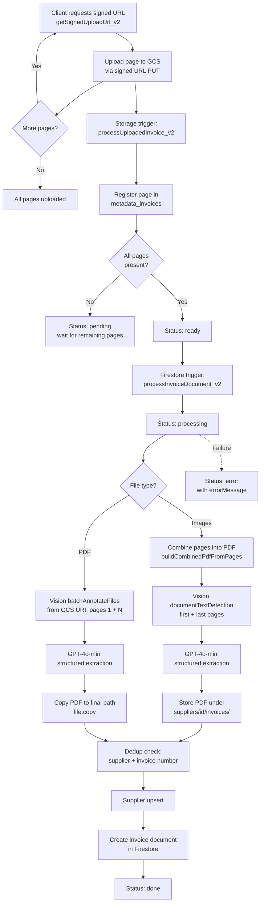

```mermaid
flowchart TD

    %% CLIENT SIDE
    A[Client requests signed URL\ngetSignedUploadUrl_v2] --> B[Upload page to GCS\nvia signed URL PUT]
    B --> B2{More pages?}
    B2 -->|Yes| A
    B2 -->|No| C[All pages uploaded]

    %% STORAGE TRIGGER
    B --> D[Storage trigger:\nprocessUploadedInvoice_v2]
    D --> E[Register page in\nmetadata_invoices]
    E --> F{All pages\npresent?}
    F -->|No| G[Status: pending\nwait for remaining pages]
    F -->|Yes| H[Status: ready]

    %% FIRESTORE TRIGGER
    H --> I[Firestore trigger:\nprocessInvoiceDocument_v2]
    I --> J[Status: processing]
    J --> K{File type?}

    %% IMAGE PATH
    K -->|Images| L[Combine pages into PDF\nbuildCombinedPdfFromPages]
    L --> M[Vision documentTextDetection\nfirst + last pages]
    M --> N[GPT-4o-mini\nstructured extraction]
    N --> O[Store PDF under\nsuppliers/id/invoices/]

    %% PDF PATH
    K -->|PDF| P[Vision batchAnnotateFiles\nfrom GCS URI, pages 1 + N]
    P --> Q[GPT-4o-mini\nstructured extraction]
    Q --> R[Copy PDF to final path\nfile.copy]

    %% POST-OCR
    O --> S[Dedup check:\nsupplier + invoice number]
    R --> S
    S --> T[Supplier upsert]
    T --> U[Create invoice document\nin Firestore]
    U --> V[Status: done]

    %% ERROR
    J -.->|Failure| W[Status: error\nwith errorMessage]
```
